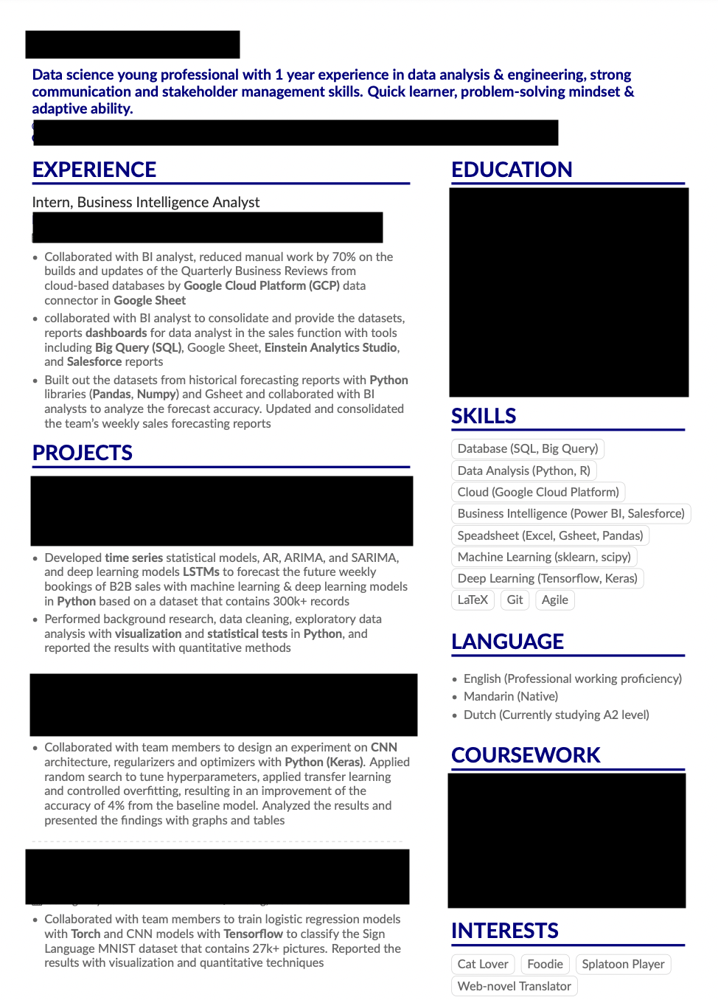

## 跑路经验 - 找工篇

工作了三个月了，一直拖延没有写找工的经验。现在当了三个月社畜，听同事讲招人的标准、谈论面试者，甚至自己也参与了面试别人，对职场有了更多的感悟，现在觉得可以好好写了。今天想动笔是因为突然想到，中国的社会是一个很容易失败的社会，我在荷兰找到第一份全职工，工作了两个月，已经可以过上体面的生活，当下的我可以想买什么买什么，不需要刻意攒钱也能攒下不少，可以自己攒钱去旅行，有养老金计划，有医疗保险所以可以做一直想做的牙齿矫正、不害怕生病。我的精神状态从上工以来就基本上都处于开心的波段，我有空也有钱探索新的事物，办公室文化很随意，同事们都很好笑。如果我还在中国，会是怎样一幅图景呢。我不可能会有独立的感觉，我会很努力，但仍然拥有不配感，不配拥有空闲，不配接受好意和好事降临，不配拥有爱，不配被喜欢。和也很想移民到荷兰的同事讲话，她说她两三年前就想要来荷兰了。我说我一步一步计划，从语言考试、申请学校、学习到工作，也花了三年才有如今的一切，她会到我这一步的。快乐的日子过着过着，会忘掉之前的艰难，既为了后来者，也为了我自己，我来写写我是如何一步一步实现跑路的计划的。这篇文为找工阶段。

# 时间线：

- 2020.6-2021.3 - 申请准备+申请季
- 2021.4-6 - 签证、租房、机票
- 2021.8.6 - 落地荷兰
- 2021.9-2022.1 - ds硕士预科
- 2022.1-2023.1 - ds硕士
- 2022.7.1-2023.1.31 - BI Analyst实习
- 2023.1.21 - 学签到期，余三个月滞留期
- 2023.3.15 - 收到offer
- 2023.5.1 - 正式开始工作

# 找工阶段

找工时间线：

- 2023.1.18-2.6 - 更新Github、LinkdIn界面
- 2023.2.3 - 毕业论文出成绩，正式确认硕士毕业
- 2023.2.7 - 正式开始投递工作
- 2023.2 - 海投阶段，约投递20家，只获得了Shell的第一轮游戏式测试（没通过）
- 2023.2 - 领英上找人connect，请求帮忙内推，回复率约40%，成功率20%
- 2023.3 - 获得ING（没通过第二轮）、Signify（拒绝了面试）的管培生项目内推，宜家Junior岗（没通过简历筛选）的内推
- 2023.3.5 - 通过荷兰朋友拿到了内推
- 2023.3.6 - 荷兰朋友的关系发邮件问我要成绩单，他收到之后在公司内部开会，将我推荐给一些组长。他开完会后回信说我成绩很好
- 2023.3.7 - 收到面试邀请
- 2023.3.8 - 去参加了一次招聘会
- 2023.3.14 - 与五个人的群面结束，基本敲定入职
- 2023.3.15-20 - 收到offer，岗位为data scientist，合同为一年+永久形式，与公司argue之后，公司愿意第一年为我办工签，而不用浪费我的search year visa
- 2023.3.27 - 去IND录入生物信息、在护照上贴工签的sticker
- 2023.4.17 - IND批准了工签
- 2023.4.18 - 领取新的居留卡
- 2023.5.1 - 正式开始工作

首先的首先，我的专业领域是数据科学，可能拥有的职业发展方向大致有data scientist, data engineer, machine learning engineer, data anaylst, business intelligence analyst，以及一些排列组合如analytics engineer等，我找工作的经验会对同是数据领域的人更有参考价值。

再首先，在荷兰找工面试的一段时间，我的体感是荷兰不兴美国刷leetcode那一套，有些大公司有code test，但中小型公司一般是性格、能力测试（就益智题）和行为测试。

总体来说，我的找工时间不长，而且结果可以说我我知道的人里最顺利的了：一、我按时毕业，没有浪费search year签证，在学签滞留期就找到了工作，且第一年合同给的是工签；二、公司地理位置交通便利，我的生活环境不需要有太大变动；三、公司本身是荷兰本地的中型公司，但在全世界都设有办公室，因此文化多元，同时很有人情味，同事关系近，重员工的长期发展，四、职位本身提供很多技能增长的训练，是我很喜欢的岗位。

我本科在国内学的翻译，后来在荷兰读了数据科学的硕士预科和预科，同时在硕士阶段做了一个BI Analyst的实习，毕业论文也是使用这家公司的数据做的。找实习本身就不简单了，找正职的难度大概是找实习的一百倍吧。荷兰找工的难度大有好几方面的原因，求职者多、岗位少，多要求荷兰语，更偏向荷兰本地人。我做过不太严谨的比较，和身边同样背景的荷兰人比起来，我海投能拿到的面试大概是他们的十分之一。得到这份工作，运气和能力五五分。入职后和老板、同事交流，发现人脉（被人内推得到面试）、我本人的履历和优秀的面试表现两者缺一不可。推荐我的人在我们公司地位很高，但他也不是说了就算，仍然需要五个面试者都对我满意，运气好的部分则是正好公司的data scientist岗位有空缺，之前的几位都离职/转岗了，对外公开要有两三年经验，但老板面完我之后对我特别满意，因此这个条件也形同虚设了。

这个部分我会分享以下的一些内容：

- 如何准备投递材料（简历、动机信、作品集）
- 如何海投（i.e. 判断公司是否是个好东家）
- 如何建立人脉
- 如何准备面试
- 签证信息分享
- 上工体验

## 如何准备投递材料

投递材料做得好，八分的背景能拥有十分的力量。一般来说筛选简历的人和面试官大概率是不是来自所投递岗位的组，因此材料要同时涉及量化的个人软实力和硬核的技术能力，要做得清晰易懂。对于动机信重不重要，人云亦云，我的想法是既然有ChatGPT了，写动机信省事很多，就尽量尽善尽美。虽然到最后我拿到岗位和动机信毫无关系，作品集也只有我现在共事的de姐姐看过，但做准备就要做全！在没有签证、不会荷兰语、没有太多人脉的劣势之下，尽量显得靠谱，会增加一些机会。事实上，虽然我没有在海投里得到非常正向的反馈（二十家里有两家面试这样），但是在通过面试后，老板联系我的时候跟我说，你的背景非常优秀扎实，申请工签肯定会过的。

从简历讲起。简历一页或者两页无所谓，我刚开始用的是如下的版式（Figure 1），后来向朋友学习，改成了一页两栏的样式（Figure 2），确实清晰了很多。我是用overleaf做的，使用了别人的模板（[AltaCV Template](https://www.overleaf.com/latex/templates/altacv-template/trgqjpwnmtgv)），但word应该也能做到。

{:.image-caption}
*Figure 1, résumé template before*

{:.image-caption}
*Figure 2, résumé after*

现在回看，这个简历还不能说尽善尽美，但也够用了。我来分块讲一下注意事项：

- 个人信息简介：要在简历开头写上自己的联系方式，包括邮箱、联系电话、居住城市，因为有些HR会有直接打电话通知面试的习惯；招聘者会考虑候选人需不需要换城市定居，一般公司偏向就近招聘，这样能节省招人的成本。要贴上自己领英的链接，如果有可以贴Github的个人主页、个人博客的链接。
- 工作经历：需要突出软硬实力，写与所投岗位相关的工作经历，实在凑不够，可以写一段能突出软实力的工作，比如教书可以着重强调沟通能力，但最好还是专业相关的经历，然后在其中带过一些软实力。我领域相关工作经历只有一段实习，因此写得很详细，主要写用什么工具、工作职责、量化的工作成就。可以一笔带过工作经历中有团队合作、跨功能交流的经历。切忌过于详细，工作经历多可以一个配一段描述，少的话写两三点也差不多了。
- 项目经历：在工作经历不够多的时候，项目可以起到相同的功能，在求学阶段就不要避开要做小组作业的课程，这样简历不至于没什么可以写。写项目也是切忌过于详细，简短地描述做了什么内容、用了什么工具、实现了什么结果就可以了。其实我做过更多的项目，但是后来发现有些工作描述要求候选人懂agile，我就修改了一版简历，选了两段侧重不同技术能力的技术项目和一段有关agile的纯商科项目。
- 教育经历：列到本科为止就行了，写学校名字、地点、求学时间，成绩好可以写一下，不好不写也没关系。
- 技能：这个是能通过简历机器筛选的关键，工作描述里提到的关键词尽量都往上写，有些技能很好学，比如SQL，网上花三四个小时学一些基础语法，做一点练习，就可以写了。但是不要撒谎！不会就是不会，不会的话真的和组里人面试是会被一眼看穿的。我到现在还觉得有点尴尬的是，我在简历里吹嘘自己会Git，其实我只是看了一两篇博文，没有真的用过，知道这个概念和会用天差地别（）所以同组的姐姐在我上工后的第一周，我问她怎么用我们平台的git，她很惊讶地说：“你不会啊，我以为你会的。”（虽然后来很快就学会了）
- 语言：会多少写多少吧，写工作的要求和自己的母语就行。荷兰语不太会也可以写上去，就说正在学习，真的需要荷兰语的工作不会通过这样的简历，但有些公司可能会觉得你在努力，放你一马（）
- 课程：可以在领英上都列出来，简历上空间不够挑一些相关的和看起来厉害的写上去就行。
- 兴趣：这块内容可有可无，不会增加成功率，也不会减少成功率。
- 证书：有业界认可度高的证书可以写，比如Azure的各类证书，比较水的或者是技能已经被涵盖在其他类别里的就不用写了。我没有拿得出手的证书，就没写。

动机信也是很让人头疼，定制很费时间，而且不一定有用，但大部分岗位都要求一封。从公司角度我可以理解， 因为简历很难看出一个人的全貌，动机信可以展现候选人更多的面向，也减少了进入面试才发现不合适的风险；但从候选人角度讲，写着写着会怀疑人生，这东西真的有人看吗？我写那么认真还得不到面试，那么写它有何用？我的建议是可以好好雕琢几个描述能力的自然段，然后根据工作描述选择其中的两个，再做适当调整。动机信要写到简历体现不了的优势，我的动机信都分四五段：开头做一个个人的总结，两个自然段一段一个技能，有时候会有第三个自然段把其他没写到但很重要的技能都简短地提一下，最后总结。

- 开头：简短的个人背景介绍和动机描述
- 中间以这样的结构写：描述公司/目前进行的转型和遇到的挑战+我认为我所应聘的岗位可以对这个目标作出的贡献+我本人的某项技能与实现这个目标如何匹配。能写成这样比较困难，所以也可以直接看工作描述，看需要哪些技能，挑一个解释一下为什么这个技能是被需要的，我本人有这个技能，并在哪些经历里得到应用和提升。
- 结尾：套话讲讲非常希望得到这个岗位、非常自信能够胜任这个岗位并推动公司发展就行

下面是我给ING写的动机信（Figure 3），就运用了上面提到的结构，最终我得到了笔试的机会，但应该是内推+背景筛选+动机信+hr电话面试筛选过关的组合作用。

{:.image-caption}
*Figure 3, the cover ltter for ING IT class.*

如果读书时候做了很多小组作业，作品集是比较容易准备的，我花了一天时间把硕士期间做过的项目写过的代码简单上传到github，写了一下介绍，再给把领英的project都贴上链接。其实在面试流程到达真正同领域的人之前是不太会有人看的，但是有github主页对搞技术的人来说显得比较专业呢。我觉得如果面试的岗位是data analyst这种技术要求不高的，不太需要github，反正都是会要做案例展现数据分析能力的。

## 如何海投

涉及到如何筛选公司和岗位。我海投的公司不多，因为荷兰范围内开放岗位符合有工签sponsor资格+不需要荷兰语+不需要工作经验的加起来就没两个。我非常想留在荷兰，因为来读书之后在这里建立了对我而言很重要的关系网，我一点都不想搬离房东家，我爱房东和他的猫猫，但是找到工作有签证有更高的优先级。我大致是打算是以一个月为周期进行实验，每一个月进行策略复盘，下个月进行一些更改，如果一切都很不妙，我可能会在search year到中期的时候就不只是投荷兰的岗位了。不过在第二个月的时候就有了好消息，所以策略只转变过一次，也就是从无脑海投，到开始领英等各种渠道上找人帮我内推，后者后来看来效果是好一些的，前者我颗粒无收。

不要因为走投无路过于绝望就放低标准，判断一个岗位好不好，我是会从公司本身的价值，与我本人地理位置、背景匹配程度进行考察的。以下是当时做的记录：

{:.image-caption}
*Figure 4, companies and positions I applied.*

在我找工前期，我三者都会考虑，但如果真的中后期还是没什么进展，我计划是放弃地理位置。总的来说，首先华人公司我完全不考虑，我会去看领英同公司同岗位的人的背景，判断这家公司的国际化程度、性别比例、同岗位的人背景和职业发展方向，有些公司是听身边的人或网上的人讲，比如文化很狼性，要避雷。即便这些都看不出来，去面试一次，也能大概明白这家公司是不是我所喜欢的。虽然在找工的时候觉得自己很弱势，有工就不错了，但找工毕竟是双向选择，如果选择了不喜欢的工，上工之后就是长久的痛苦。

## 如何建立人脉

这个比较玄学，我个人觉得是刻意为之的关系并不容易长久，而我更偏向发展长期关系。为了找工我做过的networking有在领英上和校友攀谈，寻求内推机会，去招聘会给在场的工作人员塞简历，这两个路径长期坚持应该能找到工，领英上我得到了内推机会，招聘会上也有人后来联系我问我要不要进一步聊聊，不过我只试验了一个月不到就有工了（）

在我后来和身边的人交往的过程中，我发现至少一半的人是靠身边的关系网得到工作的。而我们作为移民的劣势在于没有本地的关系网。这个我觉得尽早准备比较好，尽量和有当地交际根基的人来往，我没有刻意为之，只是以“融入”的目的，在刚来荷兰的时候非常努力地和荷兰人交朋友，我和荷兰人一起做小组作业，帮助荷兰人的学业，很难说真的得到了多少友谊，我在他们需要我的时候做好朋友的角色，但我更像他们的工具人，同学里实际上还保持频繁联系的只剩下两个，但正是其中的一个给我介绍了我现在所做的工作。

我的同事们经过被人推荐找到工的熟人途径有：朋友的男朋友、朋友、家人，不管是不是为了功利的找工，有和本地人的社交，会减少很多被异国排斥的感觉。

我在面试完当天在长毛象上写了一段我获得推荐的缘由：

> 面试到最后，那位高管进来看了看我，他看起来很和蔼可亲幽默，跟我讲起他会推荐我的缘由。他说当时他在跟我朋友讲数据，讲起公司需要数学和统计好的人。我的朋友说：我碰巧知道这样一个人！最好笑的部分是。他：啊那她不会要回中国吗？我朋友：不不不，她一点都不想回中国。
> 

> 这就是这段经历无法复制的地方……我跟她认识的契机是我跟她一起读的预科，最开始主动跟她攀谈，后来跟她做过小组作业，我在小组作业里的角色永远是解决/做出别人做不出的题目和代码。她知道我数学好、成绩好，因为我上的数学课有那种会列出同学排名的测验，我好几次是第一名（）非常impressive，跟我同期的人都觉得我数学好。而且从一开始我就给她提供数学辅导，她总想要回报我，跟我说她不想每次跟我一起做事情我就把所有事都做完，让她觉得很愧疚。
> 

> 我其实这样帮助过很多人，很多人最后并没有成为朋友，我也从来没觉得这是会得到回报的事，只是没想到命运会将我的努力以这样的方式回报我。今天本来想，这么好的事发生在我头上，那应该有代价吧，后来想，代价我早就付过了
> 

## 如何准备面试

我是在入职之后和老板一起去给人面试，观察应聘者的表现，倾听老板的反馈，才发觉我对面试做的准备非常充分，表现很好，所以给了老板很好的印象。

我在面试前做了很多准备，但最有用的还是面试前晚和朋友做的模拟面试，她向我提常见的问题，帮我梳理答题思路，跟她过了很多问题之后，第二天我思路清晰、对答如流，显得非常自信，是个靠谱的候选人。

除去模拟面试，我做的准备有：时不时在网上刷一些代码课；把公司网站上能看的信息看了一遍，公司发布了年度报告，我翻了公司信息和与我领域相关的几页；去领英上找面试官的背景，揣摩他们的工作职责和喜好。其实入职之后才发现阅读了这么多我都不太明白这家公司在做什么，很多事只有内部的人才知道，而且我的面试官们并不期待我明白公司的信息，他们对我的期望不是我懂所有的东西，而是我擅长我的领域，我有学习的能力，我可以用我的能力帮他们做一些项目。

面试常见的问题有自我介绍，选择这个职业/公司的动机，在过去工作学习中如何处理团队合作，如何学习新技能，如何向非技术背景的人解释技术。自我介绍要注意结构完整，让自己显得是一个逻辑连贯的人，善用STAR法则。比如我在介绍我自己过去的跨专业选择、实习工作、毕业论文选题的时候，会把我做选择的动机放在“我志向于用数据理解现实问题”这样一个点下，我的自我介绍结构如下：

introduction (2 min):

- education
- interests (using advanced programming languages to understand the real-life problems such as business growth)
- internship - provide business insights with SQL, Python, Google sheet
- thesis - time series to predict the future sales
- why my fit - i am equipped with xx and xx, i believe i can contribute to the business

这样的自我介绍结构清晰，并不冗长，但足以显得我是一个有条理有计划的候选人。

因为我的本科和硕士跨度很大，我特地准备了一下为什么我想要转到数据科学这个领域，果不其然老板就问了这个问题，后来我俩一起面试别人的时候，也问了候选人这个问题。我老板非常看重这个问题的回答，真实的动机可能是为了容易跑路，但回答的时候一定要结合对领域的理解，展现自己对新岗位的激情。我当时拿我写本科论文做例子，说我当时做问卷收集了数据，但是没有办法对这些数据做出漂亮的分析，但我很想要学会这个技能，所以这构成了我一部分转专业的动机。这个问题已经在面试比较后段出现了，我已经把我在荷兰做的事都七七八八介绍了一遍，所以我选择去讲一些我在来荷兰之前的生活，给面试官展现一下我在进入数据领域之前的样子。

还有一个问题就是，在数据领域，技术日新月异，所以我准备了一下我如何快速学习新技术点的例子，我是拿做小组作业的例子讲的，提了一下我从那些信息源学习，我学习的方法和结果。我后来共事的数据工程师问我，我是不是且如何了解行业内的最新模型和技术，我就拿我做毕业论文的经历举例，解释我获取知识的渠道，我锻炼技能的方式，我对学习新事物的热情。她是一个好人，我后来跟她聊很多天，她说她对junior岗位的期待就是，junior是来学习的。她很愿意教我她会的东西，时不时会说proud of me学会了新东西。这也说明面试时候并不需要装作一个全知全能的人，更重要的是快速学习的能力。

后来在和老板聊天的时候得知，他想招一个不会破坏组里气氛的人。我们组大家都很随意，经常开玩笑，我没有很刻意展现我爱笑的一面（？）但面试的时候是全程带笑容的，并适当开开玩笑，当时给几个面试官都留下了爱笑的印象。也就是说，面试时除去专业知识，性格方面也会被考察，我要展现出我不仅是个对专业知识有热情、有研究的人，还要展现我是一个容易相处的好人。

面试最后照例是我问问题，下面是我问的一些问题：

What a typical day is like; what can I expect from first three months; team structure; training and coaching for the position; the opportunities to directly work with the other team; the rules of work from home; visa sponsorship

这些问题没什么讲究，因为基本到这里面试官已经对候选人有个印象了，所以不需要出彩，就问想知道的就行。

## 签证和合同信息分享

签证的时间线如下：

- 2023.1.20 - 学签到期，此日起有三个月滞留期，至2023.4.20
- 2023.3.17 - 收到工作offer，hr表示需要我申请search year visa上工
- 2023.3.20 - 发邮件询问公司能否帮我申请工签，hr快速回复，我在当天把km工签需要的资料发给了她
- 2023.3.22 - HR提交工签申请
- 2023.3.27 - HR收到IND的确认信息，并提醒我去预约录入信息和取sticker，我立马预约了当天去Den Bosch的IND录入生物信息。当日完成了IND录入生物信息和护照上贴工签的sticker
- 2023.4.17 - IND批准了工签
- 2023.4.18 - 领取新的居留卡
- 2023.5.1 - 正式开始工作

荷兰的法律规定同一家公司一年合同最多给三次，一般来说公司会给全职工一年制合同，一年之后再给永久合同，也有公司会一下子就给永久合同（比如我实习的公司）。我拿的是一年制的合同。最开始HR说希望我能尽快上工，所以让我用search year visa，与此同时他们会准备我一年后的工签。我当时心想有工就行，就答应了，当周和象友聚餐的时候提了一下，象友建议我去跟hr争取用工签上工，多一层保险。我周一发邮件的时候努力措辞，没想到根本没有争论，hr跟我老板讨论之后，他们直接答应了，老板说因为这是我想要的，所以他会帮助我。后面的工签非常顺利，老板说因为我背景很好，所以办km签不会被卡。

合同方面，我知道网上又很多谈薪的技巧贴，但没有argue薪资，他们提的我就接受了。我后来有一次听老板吐槽面试者，说有些人条件符合，但是漫天要价，他就拒绝了，所以我的意见是谈薪什么还是谨慎一些，尤其junior岗没有太多能够谈判的底气，生涯前期经验比待遇重要。合同内容主要涵盖了薪水、工资根据通胀率上涨的程度、养老金计划、工作时间、公司发的手机电脑、假期、度假津贴、交通补贴、午餐、年终奖。我司待遇在荷兰范围也算中上，我没什么不满意的，就没有argue。

## 上工体验

我真的很喜欢我的公司、同事、工作内容，我觉得我是万分幸运才能拥有这个工作。我会从公司氛围和我工作本身体验两方面讲一讲我的体验。

我的公司规模不大不小，是国际公司，比起大公司多了很多人情味，比起小公司又多了多元性、稳定性和规则性。我上工三个月，最大的感想是，因为公司规模不是那么大，所以每个人都是无可替代和不可缺少的，每个人都很重要，能直接参与公司的改变。比如我所在的数据组，我们写出来的代码、建立的模型、维护的平台，是business方面的人每天都会用的东西。规则性在于，我们麻雀虽小，五脏俱全。各个组的分工明确，各司其职，每个组人不多，但是各种角色都有。比如我们组有一个类似产品经理的角色，会控制项目的进度，和business方面的人扯皮，把不会用到的项目掐死在萌芽状态。我们的数据平台已经有了很好的基础，并不如一些初创公司，可能招人是为了从零开始建立数据平台。

我面试的时候问老板上班的感觉，他说每天都是享受，我现在发现所言非虚。同办公室的人什么年龄段的都有，大约一半是荷兰人，一般是非荷兰人，因此办公室里大家都会讲英语，即便是四五多岁的同事也都很好笑，而且大家知道开玩笑的界限是什么，不会冒犯人。跨国公司和办公室的多元文化也让办公室的话题变得多元，同事会讲讲各自的文化，分享自己最近干了什么、有什么计划。我实习时候同事普遍年轻、内向，午餐时候只有聊工作才聊得起来，现在的公司，我的同事能手脚并用一人模仿一句指环王台词演一个中午，再无聊的笑话也有人笑得起来，我发觉人进入一个大家都爱开玩笑的环境会变得有意思，老板已经说出了“我看你一点都不内向”的虎狼之词（）老板说最重要的是希望大家能聚在一起享受快乐，他真的行动派，最近特地给办公室购买了娱乐设备，一个switch版马里奥卡丁车，一个f1驾驶模拟器，成为午休和周五的娱乐活动（

我不知道别的公司是不是这样，我发现我的部门两个人已经把电脑屏幕换成了大家的合照，生活和工作的界线清晰，大家都不喜欢加班文化，但同事也可以变成朋友。

工作方面，我这三个月主要是熟悉公司用的平台和工具，熟悉前data scientist做的项目，熟悉公司的数据。我的工作语言是python和sql，代码存在repos里，用devops控制deployment。我非常喜欢我的工作内容，因为我觉得每天都能学到新的东西很有意思，我很高兴的是，公司的管理层鼓励创新，并提供足够的资金和人力支持，我司搭建data platform的方式是行业内最先进的方式，我也通过做小任务学到了非常多data engineering和devops的知识（比来应聘mid-level data engineering的一个候选人懂得多……）。除去技术上的学习，因为公司的业务和金融有关，我每周都和risk management组的人有周会，他们教我金融市场的知识，希望我能对公司的数据多一些理解，能更好地帮他们做模型。我的上工体验就是老板对我有合理期待，给了我足够的时间学习。我学习的东西基本都是我感兴趣的，而且因为组里人少，我能看到一个项目的全貌，也很满足我的求知欲和好奇心。

总而言之，各个方面我都很满意的一份工作，感觉至少短期我不会换工作。回过头来想，我求职时候做了很多，但拥有现在的工作运气的成分还是必不可少，因为很多方面在求职的时候是看不出来的，比如公司工作的氛围、职业发展的前景，很多内容网站展现不出来。开始工作之后，工作就变成了大部分的生活，很影响心理状态，所以求职时谨慎一些，尽量避开red flag还是很重要的。

完稿于2023.7.27